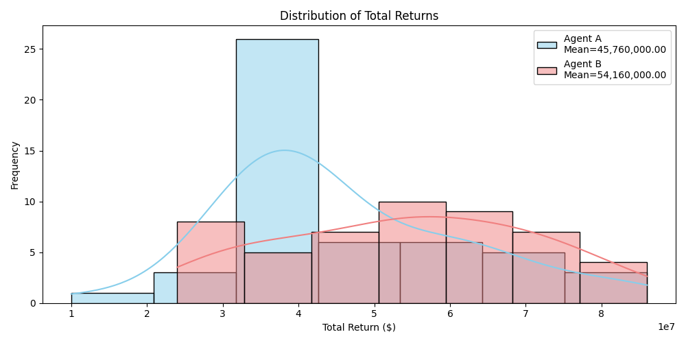

# All You Need Is Time: Predicting Early-Stage Startup Success Through Temporal and Contextual Modeling
**Vinh Tran '25, B.S. in Computer Science and Economics at Yale University**

## Project Overview

Nine out of ten startups fail, and fewer than one percent ever become billion-dollar companies. Yet for venture capitalists, these early-stage bets are where the biggest returns lie. Because most startups lack traditional financial metrics or operating history, investors rely on intuition – judgments about founder quality, product-market fit, and timing. Of these, timing is often the least visible but most critical.

This project was inspired by a claim from Bill Gross in his TED Talk: across hundreds of startups, timing explained more of the difference between success and failure than any other factor. Airbnb thrived during the 2008 recession, when people were newly open to renting out space. YouTube emerged just as broadband and Flash enabled streaming. Z.com, which tried the same idea earlier, failed because the infrastructure wasn’t there. Today, the explosion of AI startups following breakthroughs like ChatGPT reflects the same pattern: success follows not just good ideas, but the right moment.

This thesis asks whether that kind of timing intuition can be formalized. I built a predictive model of early-stage startup success that integrates both traditional structured data with external, time-sensitive signals. These include macroeconomic trends, sector momentum, and unstructured text features derived from company descriptions, founder bios, and historical industry outlooks using large language models.

To test how these predictions would influence actual investment decisions, I designed a reinforcement learning simulation that models portfolio construction over time. The results suggest that adding temporal context meaningfully improves investment strategy, offering a proof of concept for how intuition about timing can be captured, quantified, and ultimately used to make better bets on the future.

## Deliverables

1. **Develop a Predictive Model:** Incorporates timing as a critical variable, addressing its often-overlooked role in startup success. The model will integrate both traditional structured data (e.g., funding history, founder experience, industry), macroeconomics data, and unstructured textual data to provide a comprehensive evaluation and predict startup success (IPO, acquisition, additional funding round).

2. **VC Portfolio Optimization:** Use the predictions to simulate portfolio strategies for VCs and evaluate whether timing metrics improve portfolio returns. It will also incorporate reinforcement learning to optimize dynamic portfolio management, allowing real-time adjustments based on new data.

## Set Up

**Note: it is recommended to use a virtual environment for python**

```bash
# activate
$ python3 -m venv .venv
$ source .venv/bin/activate

# deactivate
$ deactivate
```

## How To Run

### Python Notebooks

```bash
# (optional) check if you are installing in virtual environment
$ which pip

# install dependencies
$ pip install -r requirements.txt

# go to folder
$ cd <folder>

# click on cell to run

```

## Folder Structure

- `Data`
   - `Input`
      - `bulk_export.tar.gz`: Raw data from Crunchbase Bulk CSV download
      - `CB_FINAL`: SQL Processed Crunchbase tables -> 1 feature set and 2 outcome sets
      - `Economic`: Economic data from APIs
   - `Output`
      - `Crunchbase`: Final feature engineered dataset
      - `Economics`: Final feature engineered dataset
      - `Final`: Final dataset used for training/testing classification model
      - `NLP`: LLM Scores (outlook alignment and founder background) and Traditional NLP Sentiment (e.g., FinBERT, VADER, TextBlob, etc.)
- `DataCollection`
   - `econ.ipynb`: Economic data collection
   - `feat_eng.ipynb`: Feature engineering and merging all 3dDatasets
   - `nlp_processing.ipynb`: Traditional NLP sentiment
   - `perplexity.ipynb`: Perplexity API for outlook reports
   - `sql_merge_cb.txt`: SQL Script used to create the tables in `CB_FINAL`
- `GoogleColab`
   - `Data`
      - `Classification_Model`: Pkl files (models, preprocessors, scalers), SHAP feature importance, model evaluation metrics
      - `RL_Model`: DQN agents, best portfolios, visualizations, etc.
   - `Model`
      - `Classification.ipynb`: Classification models
      - `NLP_Sentiment.ipynb`: LLM (Mistral) classification for outlook alignment and founder background strength
      - `Reinforcement_Learning.ipynb`: RL pipeline for VC portfolio simulation


## Results

### Classification Model
[3 Tier Models, 4 Types of Classifiers, 5 Year Label](GoogleColab/Data/Classification_Model_Metrics_1.csv)

[3 Tier Models, CatBoost, 5 and 10 Year Label](GoogleColab/Data/Classification_Model_Metrics_2.csv)

## Reinforcement Learning Model
[Agent Comparison](GoogleColab/Data/RL_Model/agent_comparison_summary.csv)

**Average Return Distribution**


## Notes

- The `GoogleColab` folder consists of files (python notebooks and data) that originally resides on my Yale Google Drive account. I simply downloaded the files and moved them into this repository. Thus, the code in these files may not run without reconfiguration because the file paths are configuired to the structure of my Google Drive. Nonetheless, all useful data used in the thesis is included in the nested `Data` Folder such that there is no need to run the code to see any data. To run the code in this folder, either 1) re-configure the file paths or 2) create an indentical environment/configuration in your own Google Drive.

